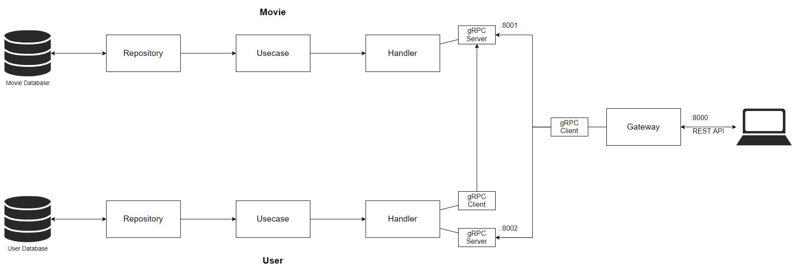

# Go Cinema CRUD API (with clean architecture)

An implementation of [clean architecture](https://blog.cleancoder.com/uncle-bob/2012/08/13/the-clean-architecture.html) structure to [Go-cinema](https://github.com/LCMTRI/Go_cinema) CRUD gRPC API.

## System architecture:

<p align="center">
    
</p>
<!-- <p align="center">
    
</p> -->

## Run

First we run 2 __gPRC Client Servers__:

```
> go run movie/movie_main.go
> go run user/user_main.go
```

Then we run our main __Gateway Server__ which will interact with public REST API:

```
> go run gateway/main.go
```